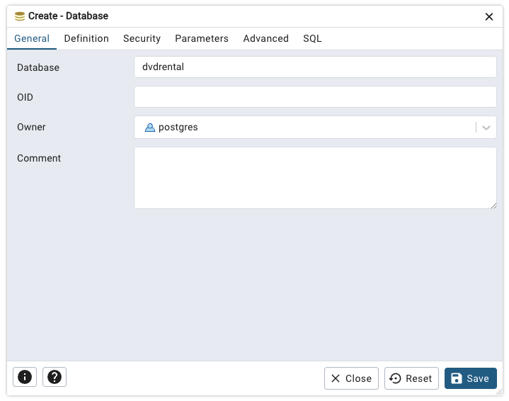
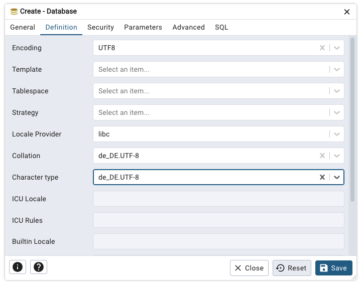

# PgSQL-Tutorial

Dieses Repository beinhaltet das Begleitmaterial
zum meinem SQL-Tutorial auf [sql-lernen.online](https://sql-lernen.online).

## DVDRental

Dies ist eine Beispieldatenbank, die einen einfachen DVD-Verleih implementiert.

### Installation

1. Erstellen Sie in pgAdmin 4 eine leere Datenbank.

    Nennen Sie die Datenbak `dvdrental`.

    

    Legen Sie Zeichensatz- und Sortiereinstellungen fest.
    
    

    Verwenden Sie, wie in der Abbildung gezeigt UTF-8.
2. Öffnen Sie ein Terminalfenster. Begeben Sie sich in das Verzeichnis, in 
   welchem Sie die Datei `dvdrental.sql` abgelegt haben. Geben Sie das 
   folgende Kommando ein, um die Anweisungen in der Datei auszuführen.
   ```
   psql -U postgres -h localhost -d dvdrental <dvdrental.sql
   ```
   Hierbei haben die Parameter die jeweils folgende Bedeutung:
   - `-U` Benutzername
   - `-h` Hostname des Datenbankservers
   - `-d` Name der zu verwendenden Datenbank

   Das Kommando ist unabhängig vom Betriebssystem. D.h., das Kommando 
   funktioniert in der angegebenen Form unter Gnu/Linux, macOS wie auch 
   unter Microsoft Windows.

   **Hinweis**: Die PowerShell untertützt keine Eingabeumlenkung! - Nutzen 
   Sie also unbedingt eine andere Shell. Unter Microsoft Windows emfehle 
   ich Ihnen die Eingabeaufforderung.